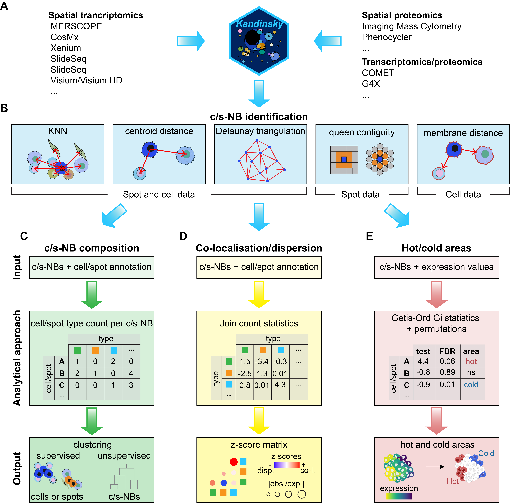

# Kandinsky

## Overview 

Kandinsky is an R package developed for deriving functional insights on cellular ecosystems from neighbour analysis of spatial omics data. Kandinsky implements different approaches for cell or spot neighbourhood identification and analysis, including supervised and unsupervised clustering for downstream functional investigations, spatial co-localisation or dispersion, and detection of gene expression patterns.




As input, Kandinsky requires:
	gene or protein expression values 
	cell or spot coordinates 
	derived from spatial transcriptomic or proteomic data.

Kandinsky implements helper functions to process data loading and formatting into a Seurat object. Using spatial coordinates, Kandinsky groups cells or spots into neighbourhoods (c/s-NBs) according to spatial relationships measured as inferred with five methods:\
	- K-nearest neighbours (KNN);\
	- Cell/spot centroid distance;\
	- Delaunay triangulation;\
	- Queen contiguity;\
	- Membrane distance.

KNN, centroid distance, and Delaunay triangulation are applicable to both spots and cells, while Queen contiguity is limited to spot data and membrane distances can be measured only from single cell segmentation data.

Once defined, c/s-NBs can be used together with cell/spot type annotation and expression values to (1) group cells, spots, or c/s-NBs, (2) measure their co-localisation or dispersion and (3) derive hot and cold expression areas within the tissue.

## Setting up Kandinsky environment
To simplify the installation process, users can first set up a conda environment using the environment.yaml file.


For conda users:
```
conda env create -f environment.yaml
```

For mamba users:
```
mamba env create -f environment.yaml
```


## Installation
After setting up the conda environment, you can activate the environment and start a new R session to install Kandinsky:

```
conda activate kandinsky
R
```


Kandinsky can be downloaded from Github and installed using `R` package `devtools`:
```r
install.packages('devtools')
devtools::install_github('ciccalab/Kandinsky')
```


Alternatively, install Kandinsky by downloading the repository on your local computer using `git`:

```
cd path/to/local/folder
git clone https://github.com/ciccalab/Kandinsky.git
#Alternative code for SSH connection: git clone git@github.com:ciccalab/Kandinsky.git
```

Then, move into `Kandinsky/` folder and install the package:
```
cd Kandinsky/
R
```
```r
devtools::install()
```

## Tutorials

To start getting familiar with Kandinsky package, and to reproduce the results shown in the original study, user can follow the tutorials available in the `vignettes/` folder or on Kandinsky website:

	- [cell/spot-neighbour based grouping](https://ciccalab.github.io/Kandinsky/articles/modC.html)\
	- [cell co-localisation/dispersion analysis](https://ciccalab.github.io/Kandinsky/articles/modD.html)\
	- [hot/cold expression areas detection](https://ciccalab.github.io/Kandinsky/articles/modE.html)\
